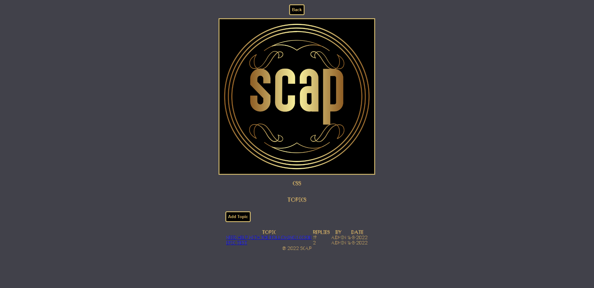
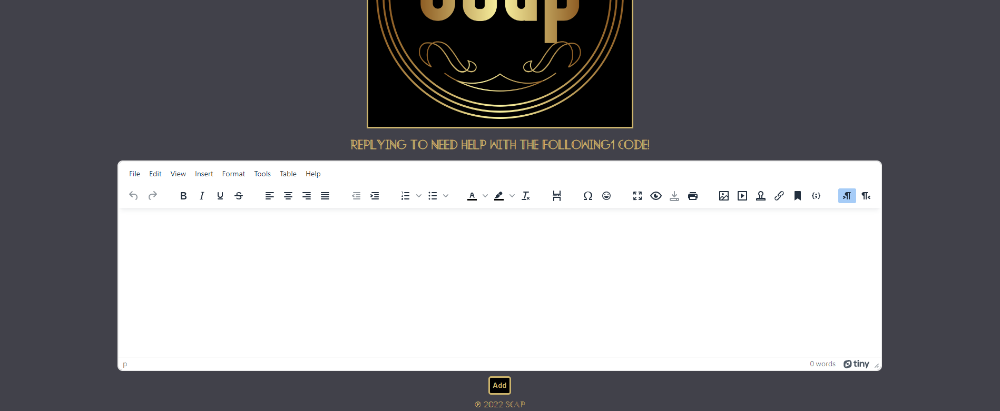
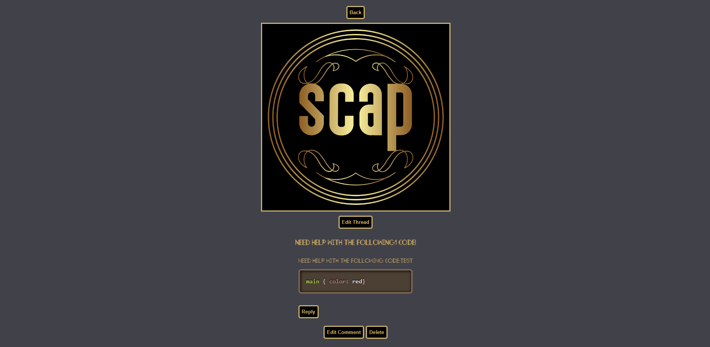

# Scap
Scap forum

#### A user based forum made with express!

## Description
This website is used as a little WIKI to find out information about characters, maps, weapons, in the game Valorant.

## Table of Contents
* [Technologies Used](#technologiesused)
* [Features](#features)
* [Design](#design)
* [Project Next Steps](#nextsteps)
* [Deployed App](#deployment)
* [About the Author](#author)

## Technologies Used
* JavaScript
* EJS
* CSS3
* jQuery
* Socket.io
* tinyMCE
* MongoDB
* bcrypt

## Features
* Users are able to browse forum without loging in or registering
* Users are able to create an account and login
* Users are able to talk to each via global live chat across the server
* Users are able to create threads, edit threads, create comments and edit comments, all Comment-to-* User
* Users can view Agent portraits, description, abilities, and ability description on hover
* Users can view overhead Map pictures, as well as coordinates of the map that it is based on
* Users can view pictures of Weapons that are in the game

## Screenshots
* Current Main Page
    
* Forum Page
    
*  Reply/Thread add
    
* Thread page
    

## Planning
* Planning was done by using Trello and scratch paper!

## Design
* Structure of the website was done by using mainly CSS3.
* The design is not complete, and will be completed soon. 

## Project Next Steps
* Creatively design website appearance
* Make profile pages to edit profile image and descirption
* Implement a game into a forum with top a top score of whoever user
* Styling

## Deployed Link
[Netlify](https://scap-forum.herokuapp.com/)

* You can view the repository:
[Github.com](https://github.com/ilsuryuz/Scap)
* If unable to view please go live locally through VS Code
    
## About The Author
I always wanted to create a user to many app, where people can gather and chat, help, and just have fun with each other. This is a starting point for all of my next apps!
